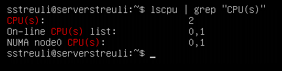
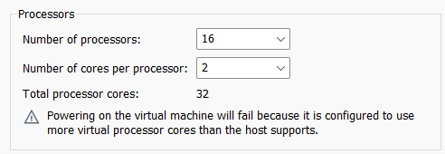
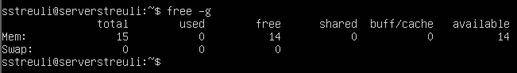
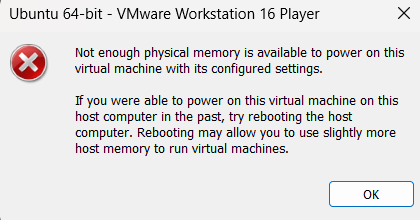

# KN01

## Screenshot weniger CPU als Host-System

## Screenshot mit Fehlermeldung mehr CPU als Host-System

## Screenshot mit weniger RAM als Host-System

## Screenshot mit mehr RAM als Host-System

## Error Erklärung

Man kann keine VM starten, die mehr Prozessoren oder RAM hat, als das Host-System hat. Da die VM Hardware vom Betriebssystem braucht und wenn die nicht vorhanden ist, ist es nicht möglich zu starten.
