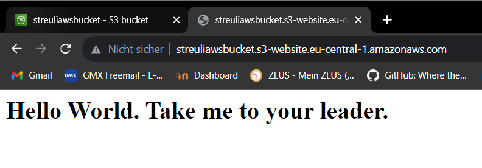

# KN02

# 4.1

## HTML-Seite inkl. URL

## Liste der EC2-Instanzen

## Details der Web-Server-Instanz

## Security-Group

# 4.2

## Liste der Buckets

## HTML-Seite inkl. URL

## Liste der Dateien im Bucket

## Eigenschaft "Static website hosting"

## Screenshot erster Schlüssel

## Screenshot zweiter Schlüssel

## Screenshot der Intanz-Detail

## Index.html

## Info.php

## Db.php

