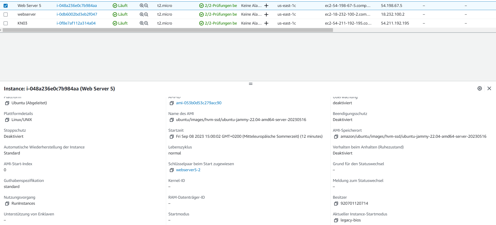
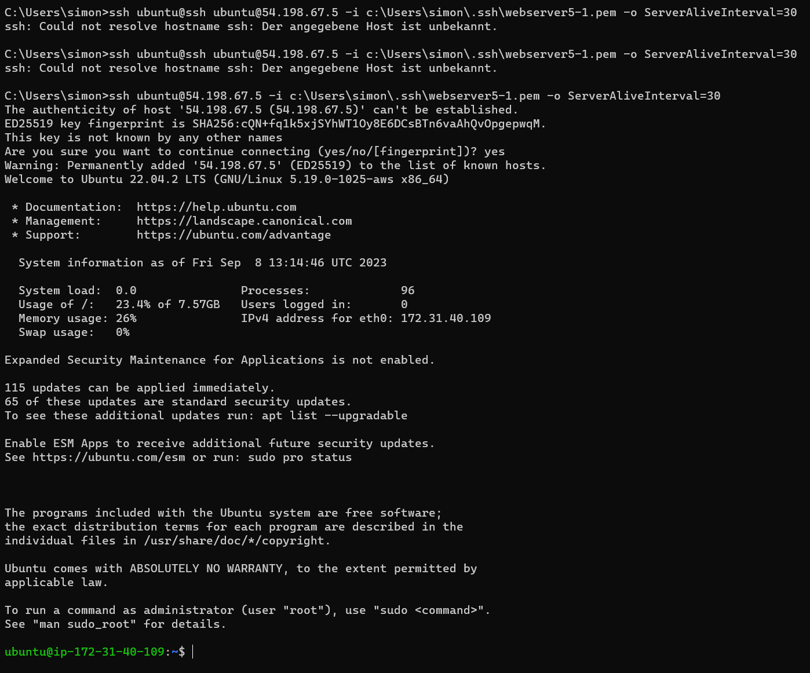
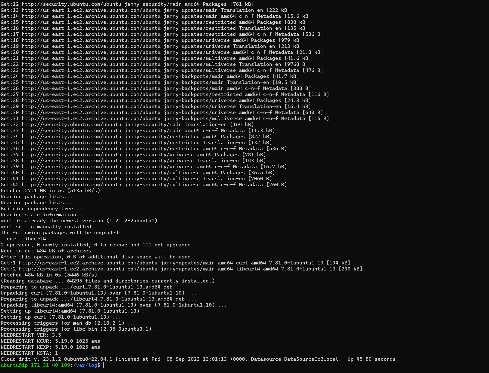
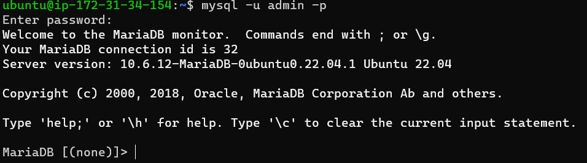
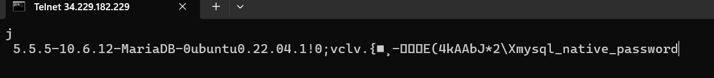
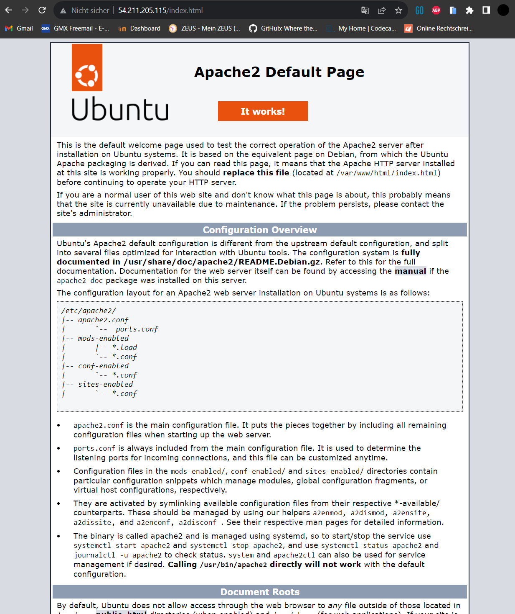
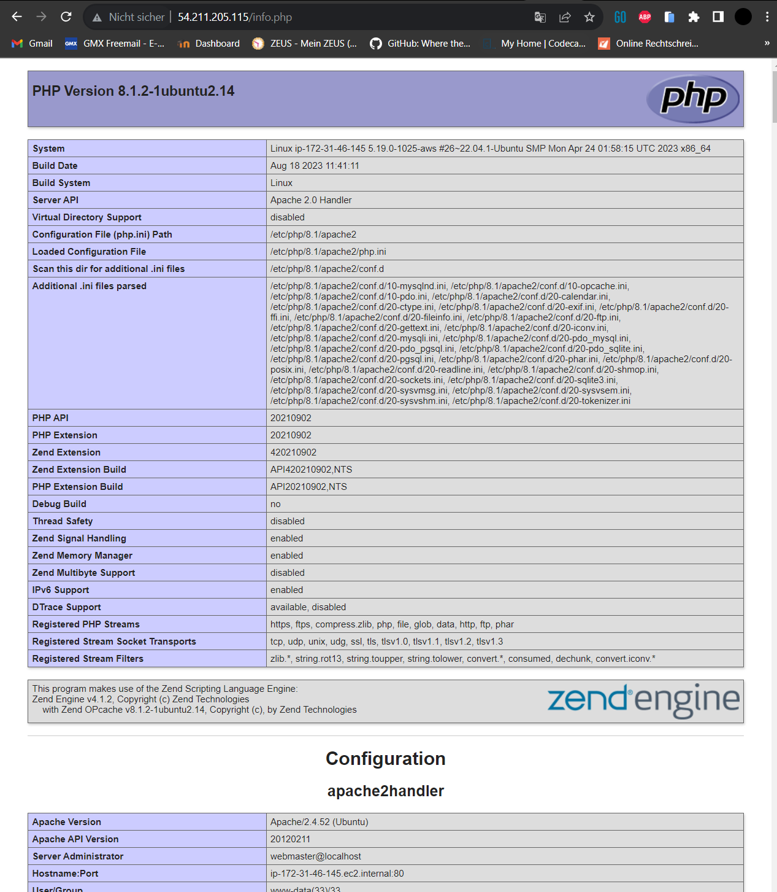
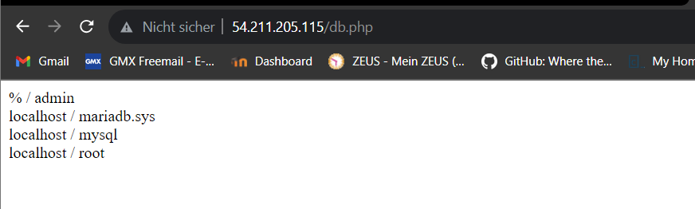
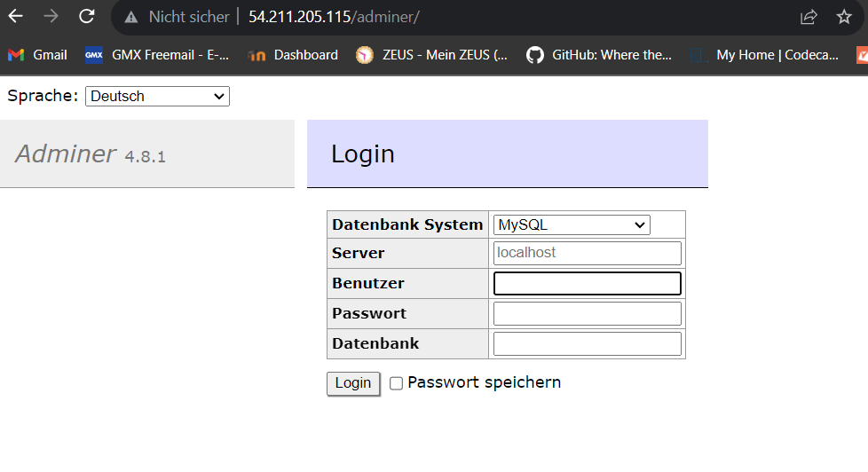
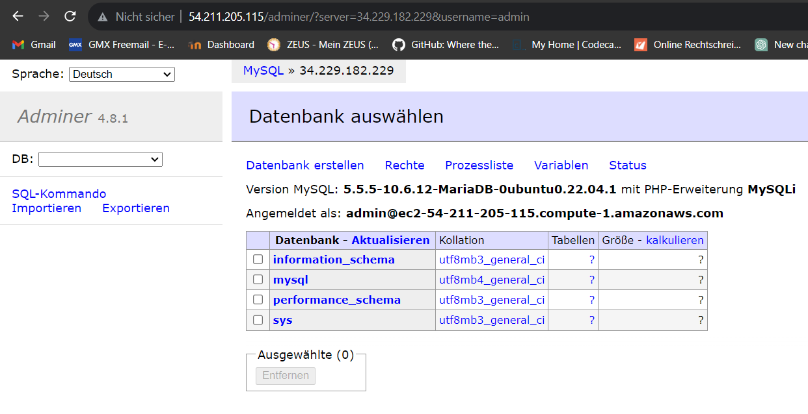

# KN03

## [Dokumentierte cloud-init.yaml](https://github.com/simonstreuli/Modul-346/blob/master/KN03/cloud-init.yaml)

## Schlüssel 2

## Funktioniert mit Schlüssel 1

## Init Log

# D

## DB

## Web

