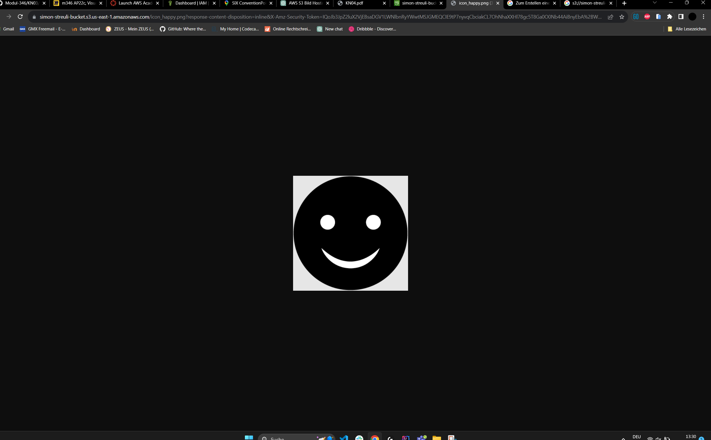
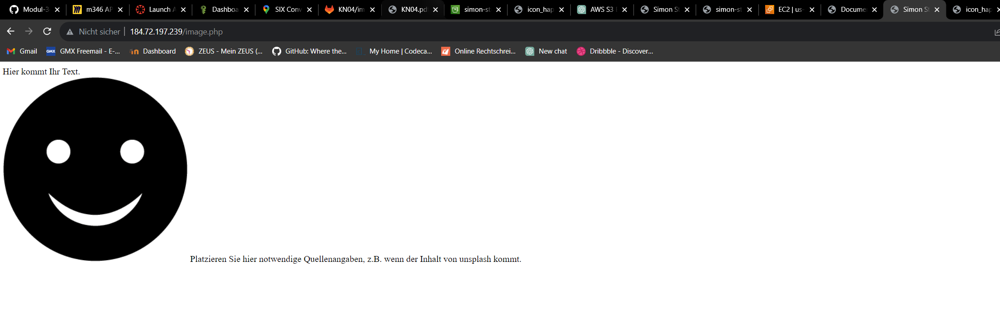
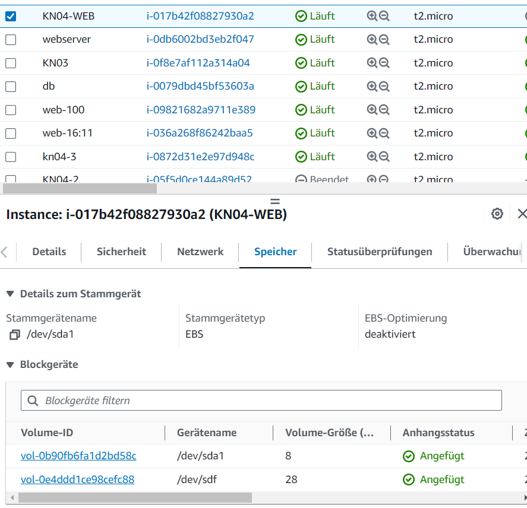

# KN04

## A

## Objekte in S3-Bucket

## Bild im Web

## [Cloud-Init für Web-Instanz](./cloud-init-web.yaml)

## C

| -                        | Typ           | Persistenz |
| ------------------------ | ------------- | ---------- |
| EBS Root                 | hot/warm/cold | ja/nein    |
| EBS Zusätzliches Volumen | hot/warm/cold | ja/nein    |
| S3                       | hot/warm/cold | ja/nein    |
