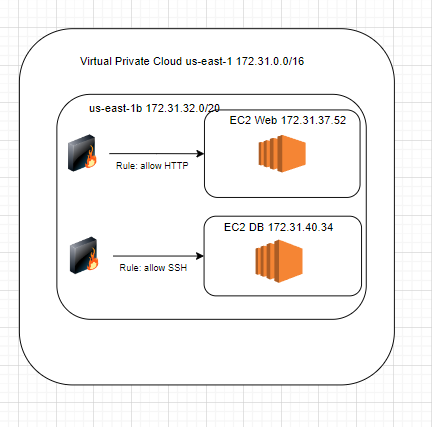
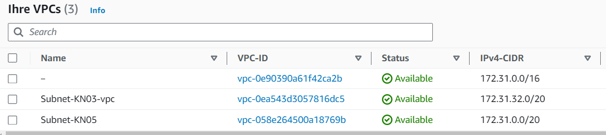
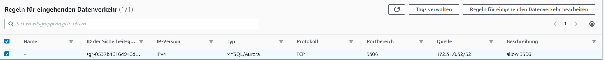
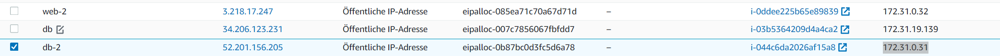
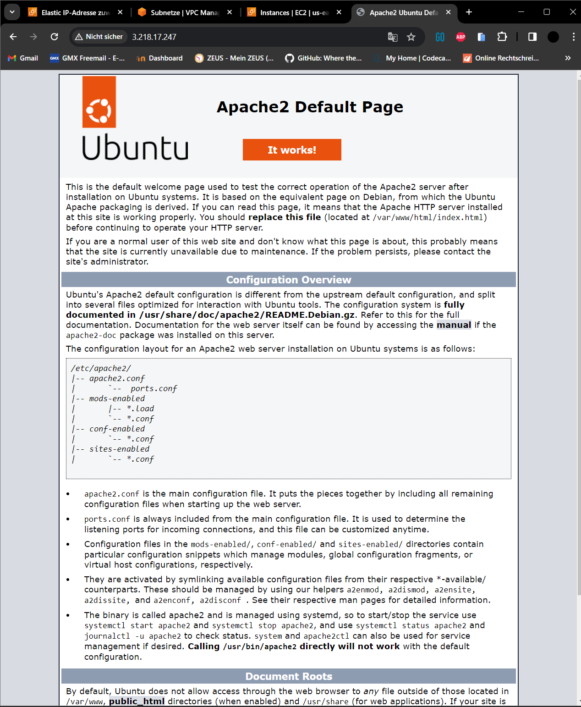
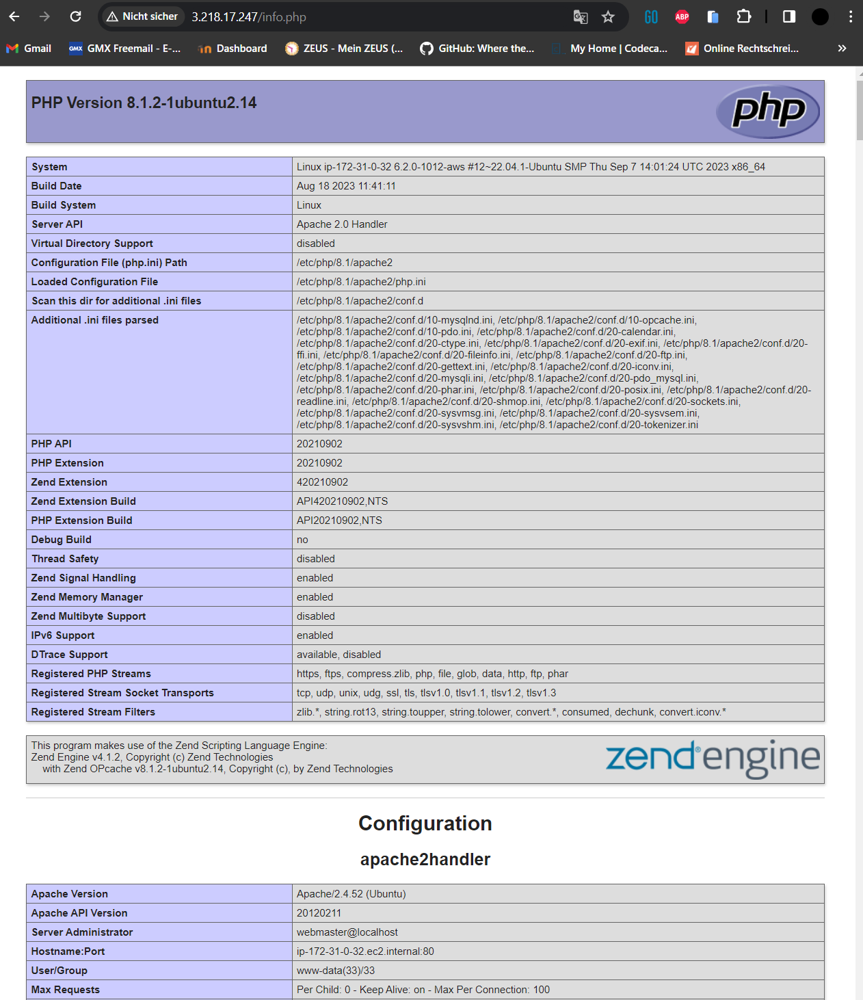
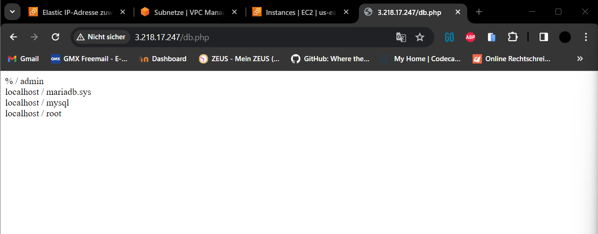

# KN05

## Diagramm



## Screenshot der Subnetzen, die die Namen zeigen



## Zwei definierte IPs für Web- und DB-Server/Instanz

- DB: 172.31.0.31
- Web: 172.31.0.32

## Objekte und Instanzen erstellen

## Screen der Liste der Sicherheitsgruppe mit sprechenden Namen


## Screenshot der Inbound-Regel für die DB-Sicherheitsgruppe



## Elastic IPS



## Index, info, db







## Screenshot der List der Instanzen, bei dem sie gestoppt sind


## Cloud-Init Web

```
#cloud-config
users:
  - name: ubuntu
    sudo: ALL=(ALL) NOPASSWD:ALL
    groups: users, admin
    home: /home/ubuntu
    shell: /bin/bash
    ssh_authorized_keys:
      - ssh-rsa AAAAB3NzaC1yc2EAAAADAQABAAABAQCGavILd6smIywMqIQDLD1kA57JQ7+Z9UCexcrWdsFk6/4FayqhJU4xUhJVqKlJmR2HI8gRczfwEA5RLE9iUk6+AD622CSRgNBMVFahxcupiHZwLdssVAq8sZXi4+mx+mCzKdc6dpSdsFOsEE9Ny+l2kx1Sv/cPyjwp204+ak4VvJb8XEOCXIPqEicNTStHjsHWn3UV+NHMJNueZW4OfHeK3VikM8fb8NkOkSl34B0kgdzmYk1fsXNOfan0maqX288f3kWo/iq3ZWmkePvPmlhsjYniZkpyuCFeYwvvju4K23DaSsrycNe/DWhdQUvZQ0MQG+PvC47Yrc5SHsYsBK2p aws-key
      - ssh-rsa AAAAB3NzaC1yc2EAAAADAQABAAABAQC0WGP1EZykEtv5YGC9nMiPFW3U3DmZNzKFO5nEu6uozEHh4jLZzPNHSrfFTuQ2GnRDSt+XbOtTLdcj26+iPNiFoFha42aCIzYjt6V8Z+SQ9pzF4jPPzxwXfDdkEWylgoNnZ+4MG1lNFqa8aO7F62tX0Yj5khjC0Bs7Mb2cHLx1XZaxJV6qSaulDuBbLYe8QUZXkMc7wmob3PM0kflfolR3LE7LResIHWa4j4FL6r5cQmFlDU2BDPpKMFMGUfRSFiUtaWBNXFOWHQBC2+uKmuMPYP4vJC9sBgqMvPN/X2KyemqdMvdKXnCfrzadHuSSJYEzD64Cve5Zl9yVvY4AqyBD aws-key
ssh_pwauth: false
disable_root: false
package_update: true
packages:
  - apache2
  - php
  - libapache2-mod-php
  - php-mysqli
runcmd:
  - sudo systemctl restart apache2
write_files:
  - path: /var/www/html/info.php
    content: |
      <?php

      // Show all information, defaults to INFO_ALL
      phpinfo();

  - path: /var/www/html/db.php
    content: |
      <?php
      //database
      $servername = "172.31.0.31";
      $username = "admin";
      $password = "password";
      $dbname = "mysql";

      // Create connection
      $conn = new mysqli($servername, $username, $password, $dbname);
      // Check connection
      if ($conn->connect_error) {
        die("Connection failed: " . $conn->connect_error);
      }

      $sql = "select Host, User from mysql.user;";
      $result = $conn->query($sql);
      while($row = $result->fetch_assoc()){
        echo($row["Host"] . " / " . $row["User"] . "<br />");
      }
      //var_dump($result);
      ?>
```

## Cloud-Init DB

```
#cloud-config
users:
 - name: ubuntu
   sudo: ALL=(ALL) NOPASSWD:ALL
   groups: users, admin
   home: /home/ubuntu
   shell: /bin/bash
   ssh_authorized_keys:
     - ssh-rsa AAAAB3NzaC1yc2EAAAADAQABAAABAQCGavILd6smIywMqIQDLD1kA57JQ7+Z9UCexcrWdsFk6/4FayqhJU4xUhJVqKlJmR2HI8gRczfwEA5RLE9iUk6+AD622CSRgNBMVFahxcupiHZwLdssVAq8sZXi4+mx+mCzKdc6dpSdsFOsEE9Ny+l2kx1Sv/cPyjwp204+ak4VvJb8XEOCXIPqEicNTStHjsHWn3UV+NHMJNueZW4OfHeK3VikM8fb8NkOkSl34B0kgdzmYk1fsXNOfan0maqX288f3kWo/iq3ZWmkePvPmlhsjYniZkpyuCFeYwvvju4K23DaSsrycNe/DWhdQUvZQ0MQG+PvC47Yrc5SHsYsBK2p aws-key
     - ssh-rsa AAAAB3NzaC1yc2EAAAADAQABAAABAQC0WGP1EZykEtv5YGC9nMiPFW3U3DmZNzKFO5nEu6uozEHh4jLZzPNHSrfFTuQ2GnRDSt+XbOtTLdcj26+iPNiFoFha42aCIzYjt6V8Z+SQ9pzF4jPPzxwXfDdkEWylgoNnZ+4MG1lNFqa8aO7F62tX0Yj5khjC0Bs7Mb2cHLx1XZaxJV6qSaulDuBbLYe8QUZXkMc7wmob3PM0kflfolR3LE7LResIHWa4j4FL6r5cQmFlDU2BDPpKMFMGUfRSFiUtaWBNXFOWHQBC2+uKmuMPYP4vJC9sBgqMvPN/X2KyemqdMvdKXnCfrzadHuSSJYEzD64Cve5Zl9yVvY4AqyBD aws-key
ssh_pwauth: false
disable_root: false
package_update: true
packages:
 - mariadb-server
runcmd:
 - sudo mysql -sfu root -e "GRANT ALL ON *.* TO 'admin'@'%' IDENTIFIED BY 'password' WITH GRANT OPTION;"
 - sudo sed -i 's/127.0.0.1/0.0.0.0/g' /etc/mysql/mariadb.conf.d/50-server.cnf
 - sudo systemctl restart mariadb.service
```
