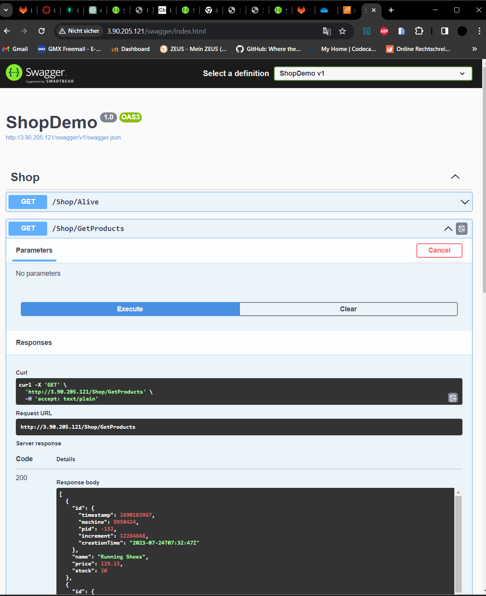

# KN06

## Reverse Proxy in eigenen Worten

Ein Reverse Proxy ist wie eine Art Server, der als Vermittler zwischen Client und dem wirklichen Server dient. Er nimmt die Client-Anfrage entgegen und leitet ihn an interne Server weiter.

## Swagger aufrufen können

## Get Products

## Collections

# B Vertikale Skalierung)

## 

**Disk erweitern**

1. Auf den Instanz Speicher
2. Auf Ändern
3. 20 GB speichern

**Instanztyp ändern**

1. Instanz stoppen nötig
2. Auf Instanzeinstellungen
3. Instanztyp ändern

## C Horizentale Skalierung)

**Erklärung**
Wir müssen eine Zielgruppe definieren, um festzustellen, welche beiden Instanzen betroffen sind. Anschliessend richten wir den Load Balancer ein, der auf diese Zielgruppe verweist, die wiederum auf die Instanzen verweist. Von dort aus können wir die DNS-Adresse des Load Balancers aufrufen, und er sollte die Last zwischen den beiden Instanzen ausbalancieren.

## D Auto Scaling

Wenn beide Instanzen gestoppt sind, erstellt sich automatisch neue mit Template.

