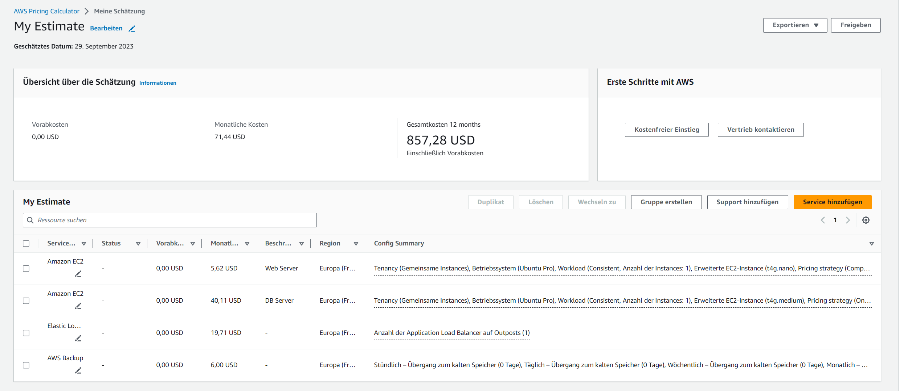
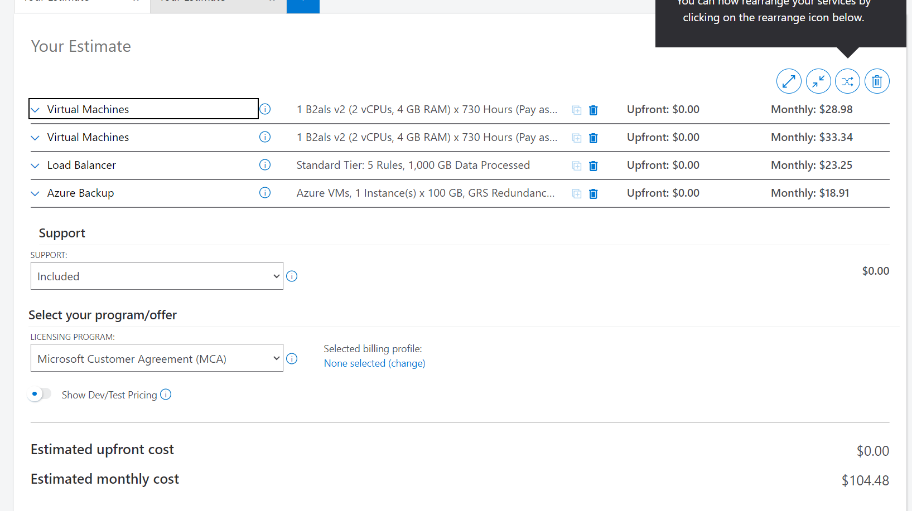
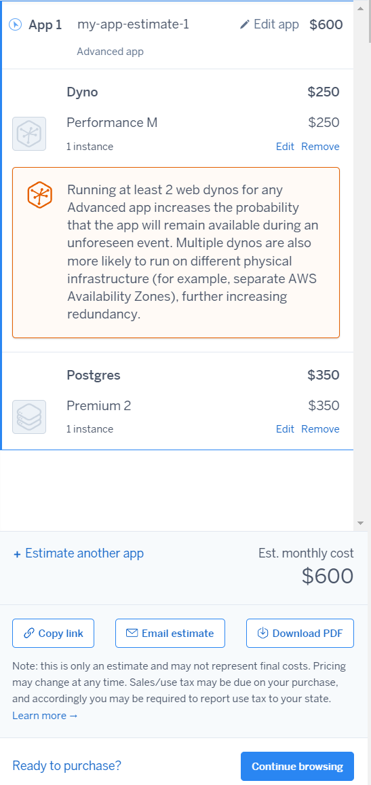
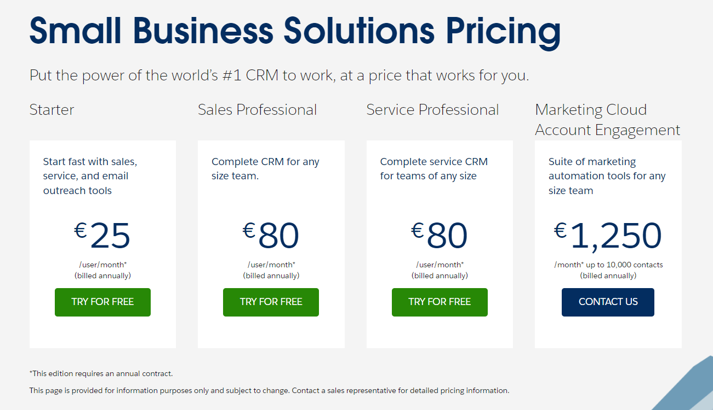

# Kostenrechnung

# 1

## AWS

**Erklärung** Web Server mit 1 Core und 2 GB Ram und 20 GB Memory. Datenbank mit 2 Cores und 4 GB Ram und 100 GB Memory. Load Balancer mit default Einstellungen. Backup mit 100 GB Speicher, da auf Datenbank Instanz auch 100 GB Speicher.

## Azure

**Erklärung** Web Server mit 1 Core und 2 GB Ram und 20 GB Memory. Datenbank mit 2 Cores und 4 GB Ram und 100 GB Memory. Load Balancer mit default Einstellungen. Backup mit 100 GB Speicher, da die Datenbank 100 GB Speicher hat.

# 2

## Heroku

# 3

## Zoho CRM

40 \* 16 = **640**

Enterprise Version da man mehr Funktionen hat und es eine höhere Sicherheit und Skalierbarkeit hat.

## Salesforce

80 * 16 = *1280\*

Sales Professional da alle Funktionen dabei sind und es ein komplette CRM Applikation ist.
